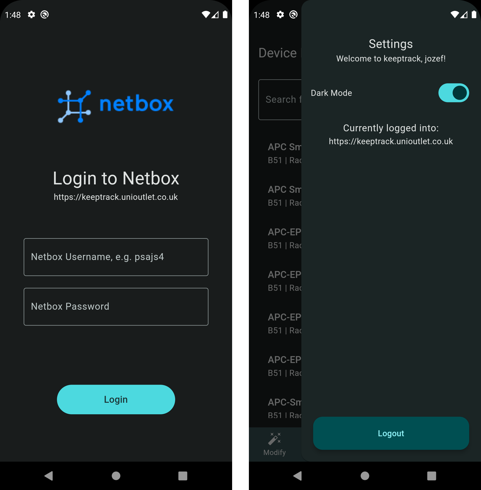
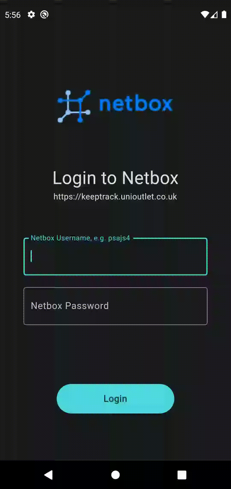
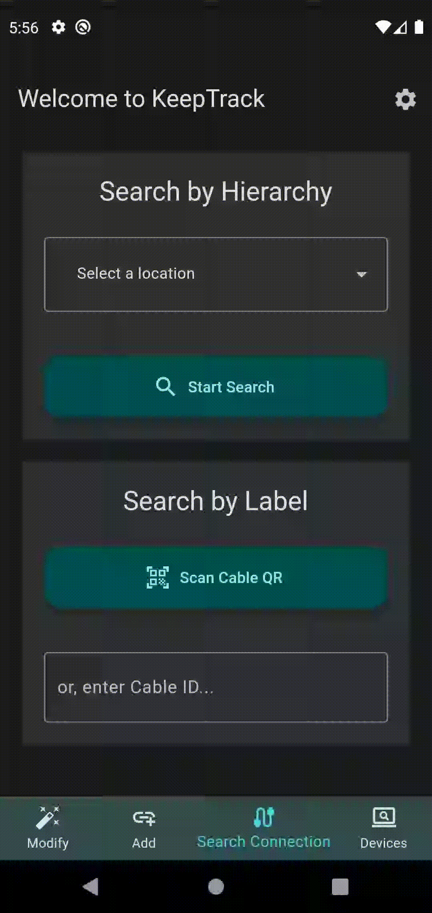
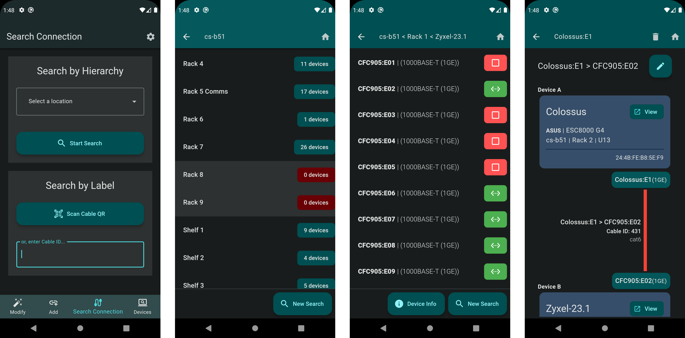
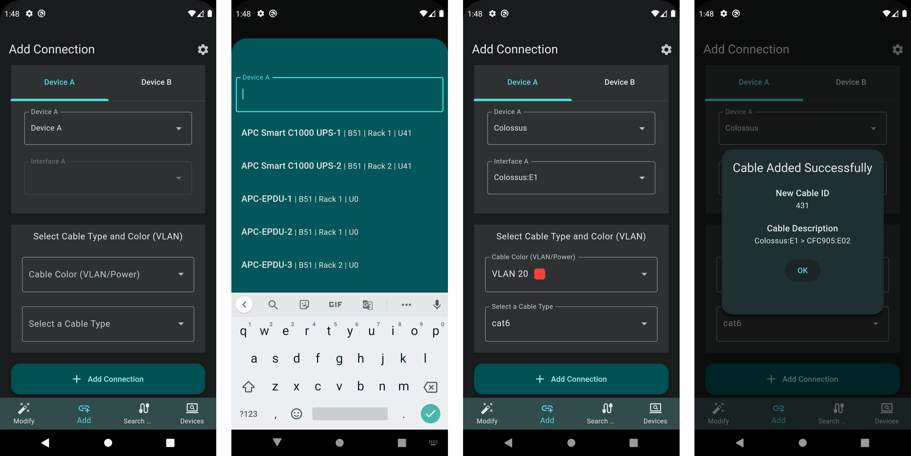
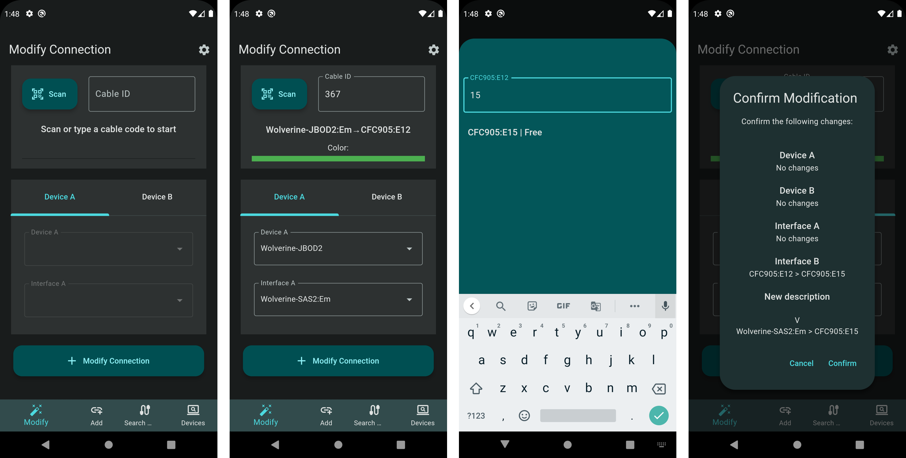
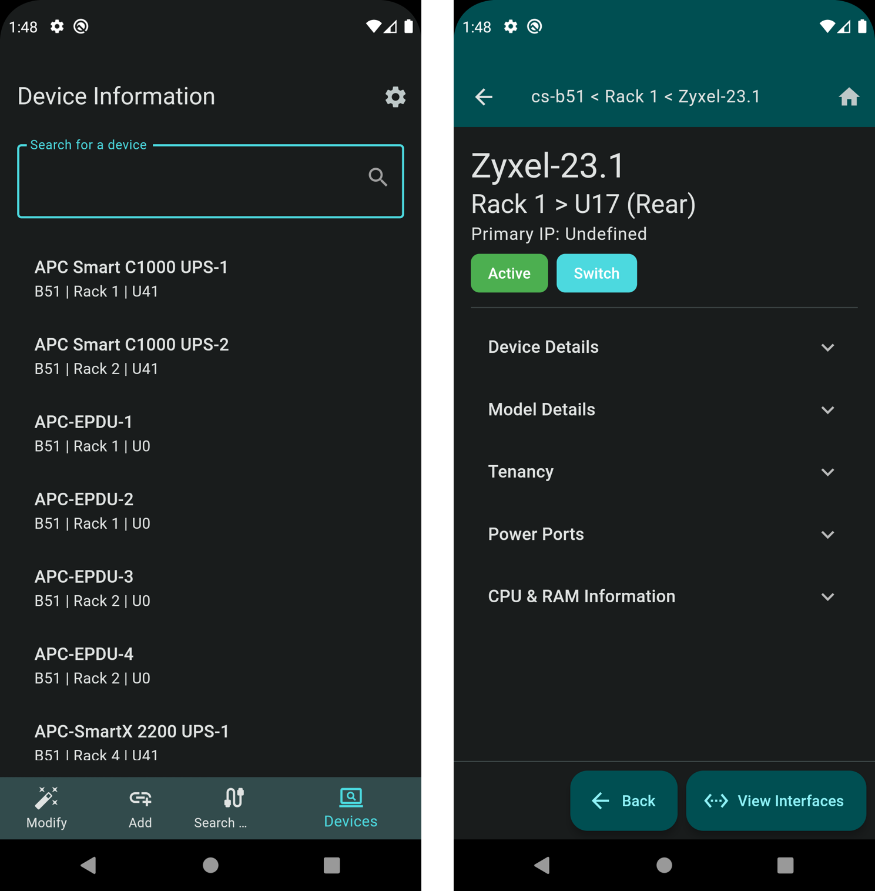

# Keeptrack User Manual
## Introduction
Keeptrack is a cross-platform application that is built upon the open source DCIM and IPAM software Netbox. The app is designed to be used by network administrators to keep track of their network devices and connections. The app is built using the Flutter framework and is available for both Android and iOS devices. The app is currently in beta and is not available on the Google Play Store or Apple App Store. The app can be installed via manual installation via the instructions below.

 

## Table of Contents
- [Installation](#installation)
- [Login Page](#login-page)
    - [Logging out](#logging-out)
- [Search Page (Home Page)](#search-page-home-page)
- [Add Connection Page](#add-connection-page)
- [Modify Connection Page](#modify-connection-page)
- [Device Information and Searching Page](#device-information-and-searching-page)
- [Final Notes](#final-notes)

 

---
  

## Installation

1. Clone the repo and setup a flutter environment, see [here](https://flutter.dev/docs/get-started/install) for instructions.
2. Modify the .env file to point to your Netbox instance. The .env file is located in the root directory of the project. For example `https://netbox.domain.tld`. No trailing slash or api path is required.
3. Run `flutter pub get` to install dependencies
4. Connect your device to your computer and enable USB debugging.
5. Select your device from the list of devices by running `flutter devices` and not the name of the device.
6. Run `flutter run -d `**`devicename`** to run the app.

  

## Login Page and Side Menu

Shown below is the current login screen (left) and side menu (right). The side menu is accessible by swiping from the left side of the screen or by clicking the `Menu Icon` in the top right corner of root pages. The side menu is not accessible on the login page.

To login, enter your `Netbox` username and password and click the `Login` button. The app will then attempt to authenticate with Netbox and will display an error message if the login fails. If the login is successful, the app will navigate to the search page.

> Note that the username field is not case sensitive, but the password is. 

> This process can be seen below.

 

### Logging out
To log out of Keeptrack, navigate to a root page (Search Page, Add Connection Page, Modify Connection Page, or Device Information and Searching Page) and click the `menu icon` in the top right corner. Then click the `logout` button at the bottom of the side menu. The app will then navigate to the login page and delete the user's credentials from the device.

> This process can be seen below.

 

---

  

## Connection Search Page (Home Page)

Shown below is the connection search pages. Where the flow starts left-to-right. This is the default page that the user is shown once login is complete and or the app is opened. The search page is the main page of the app and is used to search for connections and devices. 

To search for a device there are two methods, first by hierarchy and second by an existing Cable ID. 

 

### Searching by hierarchy
Searching by hierarchy allows the user to narrow down the search by narrowing down the location of the connection. Firstly, the user selects the floor and or room that the connection is located in. Then the user selects the rack that the connection is located in. Finally, the user selects the device that the connection is located in. Once the user has selected the device, the app will then display all the connections that are located on the device.

To complete this process following the steps below.
1. Select a `Location` from the top dropdown menu on the Search Connection page. (Left image above)
2. Once the location is selected, the app will then display all the `Racks` (desks) that are located in the selected location. Select a `Rack` from the list of racks. (2nd from left image above)
3. Once the rack is selected, the app will then display all the `Devices` that are located in the selected rack. Select a `Device` from the list.
4. Once the device is selected, the app will then display all the connections that are located on the selected device. (2nd from right image above). 
- The icon right of the connection name is the current status of the connection. If the icon is green, the connection is active. If the icon is red, the connection is inactive.
5. To view the information of a connection, `click on the connection`. (Right image above)
- Here the user is shown the selected connection's information. The user can also `modify the connection by clicking the modify button`. (Right image above).
- The user is shown both devices of the connection as well as information of their location  and model. To view these devices, click on the view button. (Right image above)
    > If available the user can also see the interfaces MAC address and IP address. (Right image above)
- Following the device, the interface information is shown. This includes the interface name and interface type. (Right image above)
- Further, the specific cable information is shown in the center of the page. This includes the cable ID, cable type, and cable color. (Right image above)

> This process can be seen in the gif below.

 

### Searching by cable ID/label.
Searching by cable ID allows the user to search for a connection by entering the cable ID or by scanning the cable QR code. To search by cable ID, follow the steps below.

1. Click the `Scan Cable QR` button on the Search Connection page. (Left image above)
2. The app will then navigate to the Scan Cable QR page where the user can scan the QR code on the cable.
3. On detection of the QR code, the app will then navigate to the connection information page. (Right image above).
- Alternatively, the user can enter the cable ID into the text field and once submitted the app will navigate to the connection information page. (Right image above).

> This process can be seen in the gif below.

 

---

  

## Add Connection Page
Shown below is the add connection page. This page is used to add a new connection between two interfaces (devices) to the Netbox database. To add a new connection, follow the steps below.

1. Select a device from the dropdown menu on the `Device A` section. (Left image above), then select an interface from the dropdown menu on the interface section below the device. (Left image above). 
2. Repeat step 1 for the second device by navigating to the `Device B` tab by tapping the `Device B` label. (Right image above)
3. Once both devices and interfaces are selected, select the cable colour from the drop down menu. (2nd from right image above)
4. Select the `Cable Type` from the drop down menu. (2nd from right image above)
5. Press the `Add Connection` button to add the connection to the Netbox database. (Right image above)
6.  The app will then display a success dialog and clear parts of the form. Click the `OK` button to navigate back to add another connection. (Right image above)

>This process can be seen in the gif below.

 

---

  

## Modify Connection Page

Shown below is the modify connection page. This page is used to modify an existing connection between two interfaces (devices) in the Netbox database. To modify an existing connection, follow the steps below. 
> Note that the current implementation of modifying a connection in Keeptrack first deletes the existing cable and then creates a new cable. This is due a bug in the Netbox Cable API which is reported [here](https://github.com/netbox-community/netbox/issues/11901).

1. Click the `Scan` button to scan the QR code on the cable, located at the top of the Modify connection page. (Left image above) Or enter the cable ID into the text field submit.
2. If cable exists the app will then automatically populate the page with the connection information. (2nd from left image above).
- This includes the cable label, color and the terminating devices and interfaces. 
3. To modify the connection, select a device or interface from the side of the cable desired. This can be changed by clicking the tab button at the middle of the page (2nd from left image above), labelled as `Device A` and `Device B`.
4. Once a device or interface is changed the user can then click the `Modify Connection` button to modify the connection. (Right image above).
5. The app will then display a confirmation dialog where the user is shown the summary of the changes. (Right image above). Select `Confirm` to confirm the changes or `Cancel` to cancel the changes.
6. The app will then display a success snackbar and automatically update the app with the new cable ID and connection information.

>This process can be seen in the gif below:

 

--- 

  

## Device Information and Searching Page
Shown below is the device information and searching page. This page is used to view the information of a device and search for connections on the device. To view the information of a device and search for connections, follow the steps below.

1. To view the information of a device, either scroll through the list of devices on the home page or search for the device using the search bar at the top of the Device Information page. 
- As the user types, the app will then display a list of devices that match the search query. (Left image above)
2. Once the device is selected, the app will then navigate to the device information page. (Right image above)
- Here the user is shown the device's information. This is broken down into a main overview section as well as a list of expandable sections. (Right image above)
- The main overview section shows the device's name, device location, primary IP address, device tags, and device status. (Right image above)
    - The user can also view from the expandable sections the device's details, model details, tenant details, power ports and CPU & RAM. (Right image above).
    > To view the details of a section, click on the section name. (Right image above)

    > To close the section, click on the section name again. (Right image above)
- The user can also view the device's interfaces by clicking the `Interfaces` button. (Right image above)
- Finally the user can navigate back up the search tree or back to the home page by clicking the `Back` button. (Right image above). Additionally to navigate directly to the home page, the user can click the `Home` icon button in the top right. (Right image above)

>This process can be seen in the gif below.

 

--- 

  

## Final Notes
> The app leverages on a specific installation of Netbox and so some elements of the app may not work on other installations of Netbox.